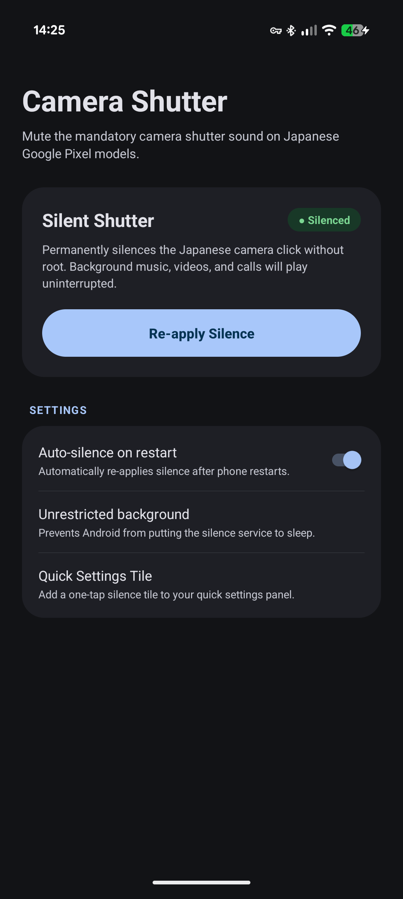

# SilentPixel: Pixel Japanese Camera Shutter Mute

[](#)
[](#)
[](#)
[](LICENSE)

> **Permanently silence the mandatory Japanese Google Pixel camera shutter sound on official Stock Google Camera — without Root, without SIM card tricks, and without pausing, ducking, or glitching your background music or calls.**

Tested and verified on **Google Pixel 10 Pro XL**, **Pixel 9 Pro**, **Pixel 8 / 8 Pro**, **Pixel 7**, and **Pixel 6** on Android 14, 15, and 16.

---

<p align="center">
  
</p>

---

## 🎯 Why This Project Exists

Google Pixels manufactured for the Japanese domestic market (Hardware SKU `AJP` / `GYPW4`, etc.) enforce a loud, mandatory camera shutter sound.

Outside Japan, Google's firmware is designed to allow muting only if the phone connects to a physical base station broadcasting a foreign Mobile Country Code (`MCC`). However:
* If you are in airplane mode, taking photos in a museum, subway, or areas with poor cellular coverage, the camera sound forcefully re-arms itself.
* If you use physical or eSIM profiles that don't continuously update MCC, the click stays permanently loud.

### Comparison with other workarounds

| Method | Works on Stock Camera? | Music / Spotify Plays Cleanly? | Zero Camera Startup Lag? | No Root / No Unlock? |
| :--- | :---: | :---: | :---: | :---: |
| **SilentPixel (This tool)** | **✅ Yes (100% Stock)** | **✅ Yes (Zero interruption)** | **✅ Yes (0 ms delay)** | **✅ Yes** |
| **Play Store "Mute Camera" apps** | ⚠️ Glitchy | ❌ Abruptly pauses/ducks audio | ❌ 1–2 second lag on launch | ✅ Yes |
| **GCam Ports (AGC / BSG)** | ❌ Replaces stock camera app | ✅ Yes | ⚠️ Varies by port stability | ✅ Yes |
| **Root (Magisk / KernelSU)** | ✅ Yes | ✅ Yes | ✅ Yes | ❌ Wipes phone data |

---

## 💡 The Discovery: Audio Volume Group 7

### Why traditional volume sliders and old ADB commands failed
In AOSP's `AudioService`, the camera sound stream (`STREAM_SYSTEM_ENFORCED`, Stream 7) is hardcoded to reject volume reduction when `isCameraSoundForced()` is true:
```java
// AudioService.java
if (mCameraSoundForced) {
    // Normal stream volume adjustment for Stream 7 is silently ignored!
}
```

### The Solution: Direct Audio Policy Group Routing
Modern Android (Android 11 through 16) abstracts stream types into **Audio Volume Groups**.
* `STREAM_SYSTEM_ENFORCED` is mapped to **Volume Group 7** (`AUDIO_STREAM_ENFORCED_AUDIBLE`).
* The low-level Android audio command-line tool `cmd audio` allows setting volume directly on the group level:
  ```bash
  cmd audio set-group-volume 7 0
  cmd audio adj-group-volume 7 MUTE
  cmd audio set-group-volume 2 0
  cmd audio adj-group-volume 2 MUTE
  ```
This directly forces the hardware HAL speaker volume index for the enforced group to `0` and sets its status to `Muted: true`. 
* **Media playback (Volume Group 4)** is completely unaffected — your Spotify, YouTube, or podcasts keep playing with zero interruption.
* **Voice calls (Volume Group 1)** and notifications remain fully functional.

---

## 🚀 How to Use

Choose the method that best fits your workflow:

---

### Method 1: One-Click PC Script (Easiest, No App Needed)

If you have a computer and plug your phone in occasionally, this takes **literally 5 seconds**:

1. **Enable USB Debugging on your Pixel**:
   * Go to **Settings → About Phone** → tap **Build Number** 7 times.
   * Go to **Settings → System → Developer Options** → enable **USB Debugging**.
2. **Connect phone to your PC via USB** and tap *"Always allow from this computer"*.
3. **Run the script**:
   * **Windows**: Double-click `mute.bat`.
   * **macOS / Linux**: Open Terminal and run:
     ```bash
     chmod +x mute.sh
     ./mute.sh
     ```
4. **Done!** The camera shutter is completely silent. It will remain silent until you reboot your phone.

---

### Method 2: SilentPixel App + Shizuku (100% On-Device Standalone)

If you want to silence the camera on the go without ever needing a computer:

1. Download and install **`SilentPixel.apk`** from [Releases](https://github.com).
2. Install **[Shizuku](https://play.google.com/store/apps/details?id=moe.shizuku.privileged.api)** (free, open-source on Google Play).
3. Open Shizuku and start it via **Wireless Debugging**:
   * Tap *"Start via Wireless debugging"*.
   * Developer Options → Wireless Debugging → *"Pair device with pairing code"*.
   * Enter the 6-digit code in the notification shade.
4. Open **SilentPixel**:
   * Tap **"Silence Shutter"**.
   * Turn on **"Auto-silence on restart"**.
5. **Done!** Whenever Shizuku is active, SilentPixel automatically ensures the shutter stays silent in the background.

---

### Method 3: Termux One-Liner (For Power Users)

If you have **Termux** installed on your Pixel:

#### Via Shizuku (Rish):
```bash
rish -c "cmd audio set-group-volume 7 0 && cmd audio adj-group-volume 7 MUTE && cmd audio set-group-volume 2 0 && cmd audio adj-group-volume 2 MUTE"
```

#### Via Local ADB in Termux:
```bash
pkg install -y android-tools
adb connect localhost:<port>
adb shell "cmd audio set-group-volume 7 0 && cmd audio adj-group-volume 7 MUTE && cmd audio set-group-volume 2 0 && cmd audio adj-group-volume 2 MUTE"
```

---

## 🔍 How to Verify

To verify that the enforced audio group is currently muted on your device, run:
```bash
adb shell "dumpsys audio | grep -E 'VOLUME GROUP AUDIO_STREAM_ENFORCED_AUDIBLE' -A 4"
```

Expected output:
```text
- VOLUME GROUP AUDIO_STREAM_ENFORCED_AUDIBLE:
   Muted: true
   Min: 0
   Max: 7
   Current: 2 (speaker): 0
```

---

## ❓ Frequently Asked Questions (FAQ)

#### Does this survive a phone reboot?
In Android, the audio HAL volume group table is loaded into RAM upon boot. When the phone is rebooted, Android's kernel resets all volume groups to default. 
* With **Method 1 (PC)**: Simply re-run `mute.bat` after rebooting. Since modern smartphones are typically rebooted only once every few weeks, this takes 5 seconds.
* With **Method 2 (Shizuku)**: Open Shizuku, tap start, and SilentPixel mutes it automatically.

#### Will Google patch this?
Unlikely. The `cmd audio` CLI tool is an official, non-exploitative developer interface provided by AOSP for Audio Policy HAL testing. Because modifying volume groups requires developer permissions (`AID_SHELL`), Google treats it as an intentional developer configuration. It does not tamper with system partitions or trigger Play Integrity / SafetyNet flags.

#### Does this break phone ringers, alarms, or timers?
No. Alarm audio uses `AUDIO_STREAM_ALARM` (Group 6), ringers use `AUDIO_STREAM_RING` (Group 2), and timers use their respective audio usage profiles. The commands target only `AUDIO_STREAM_ENFORCED_AUDIBLE` and the sub-aliased click trigger.

---

## 🛡️ Privacy & Safety
* **Zero network permissions used for tracking**: SilentPixel contains no analytics, telemetry, trackers, or ads.
* **Read-only system integrity**: Does not write to `/system`, `/vendor`, or `/data`.
* **Open Source**: Full source code is available in this repository under the MIT License.

---

## 📄 License
This project is licensed under the [MIT License](LICENSE).
Feel free to fork, contribute, and share!
